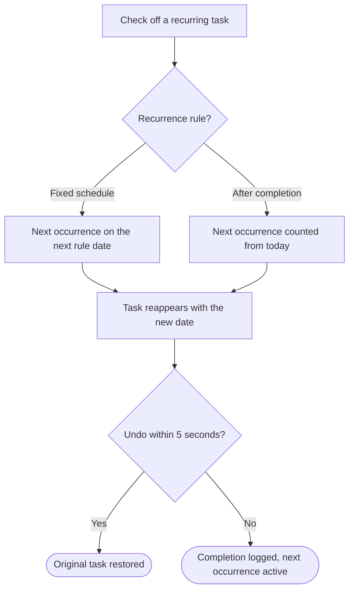

# Complete a recurring task

## Goal

Check off a task that repeats and have the next occurrence scheduled automatically, without losing the history of what was done.

## Flow

## Behavior details

#### Recurrence rule?

**Possible outcomes**
- "every monday" style rules keep their schedule even when completed late
- "every! 3 days" style rules restart from the completion day
- ⚠️ Behavior unclear from the current implementation. What happens when the next occurrence would fall in the past after a long gap is not covered by the UI or tests.

## Related features

- [Complete and restore tasks](../features.md#complete-and-restore-tasks)
- [Schedule and reschedule](../features.md#schedule-and-reschedule)

## Related flows

- [Plan the day](plan-the-day.md): where recurring tasks are usually completed.

## Implementation references

- Recurrence: `src/lib/recurrence.ts`
- Tests: `src/lib/recurrence.test.ts`
