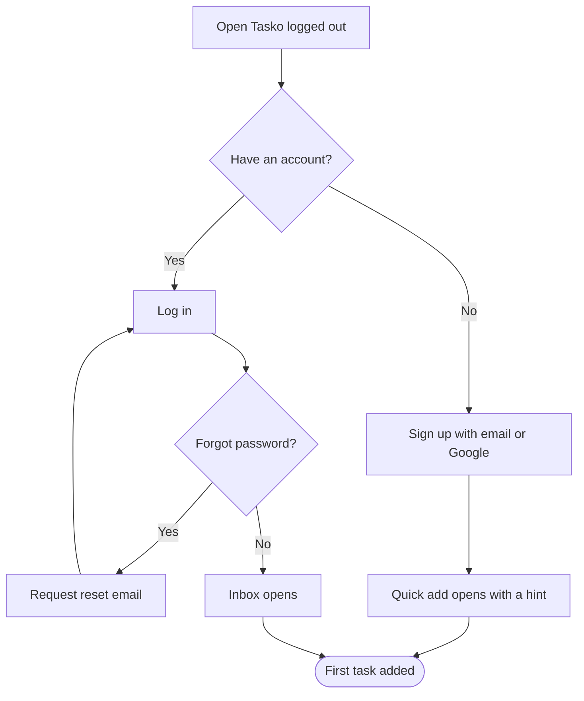

# Get started

## Goal

Create an account, or log in to an existing one, and land in the app ready to add a first task.

## Flow

## Behavior details

#### Sign up with email or Google

**Possible outcomes**
- Email already registered: the form offers to log in instead
- Google sign-in cancelled: the user stays on the sign-up page

#### Request reset email

**Result**
- A reset link valid for 1 hour is emailed; the page always says "check your email" whether or not the address exists

## Related features

- [Sign up and log in](../features.md#sign-up-and-log-in)
- [Add a task](../features.md#add-a-task)

## Related flows

- [Add a task](add-task.md): continues from the quick add hint.
- [Share a project](share-project.md): invitees without an account arrive here.

## Implementation references

- Auth pages: `src/app/(auth)/`
- Session: `src/server/auth.ts`
