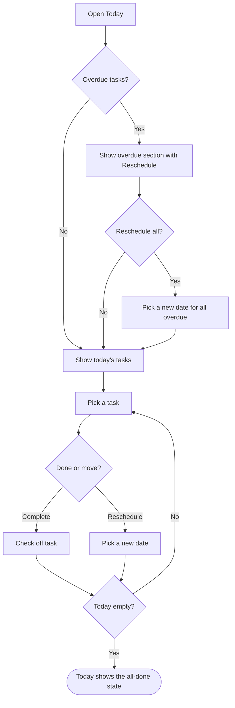

# Plan the day

## Goal

Start the day from the Today view, deal with anything overdue, and work through the list by completing or rescheduling tasks until Today is empty.

## Flow

## Behavior details

#### Show overdue section with Reschedule

**Result**
- Overdue tasks are listed first, grouped under an "Overdue" heading with a Reschedule action
- A saved filter can be applied to narrow the list to, for example, "today & p1"

#### Check off task

**Result**
- The task leaves Today with a short undo toast
- A recurring task is replaced by its next occurrence instead of disappearing (see [Complete a recurring task](complete-recurring-task.md))

## Related features

- [Schedule and reschedule](../features.md#schedule-and-reschedule)
- [Complete and restore tasks](../features.md#complete-and-restore-tasks)
- [Labels and filters](../features.md#labels-and-filters)

## Related flows

- [Add a task](add-task.md): where dated tasks come from.
- [Complete a recurring task](complete-recurring-task.md): the special case when a checked task repeats.

## Implementation references

- Today view: `src/features/today/TodayView.tsx`
- Bulk reschedule: `src/features/today/RescheduleOverdue.tsx`
