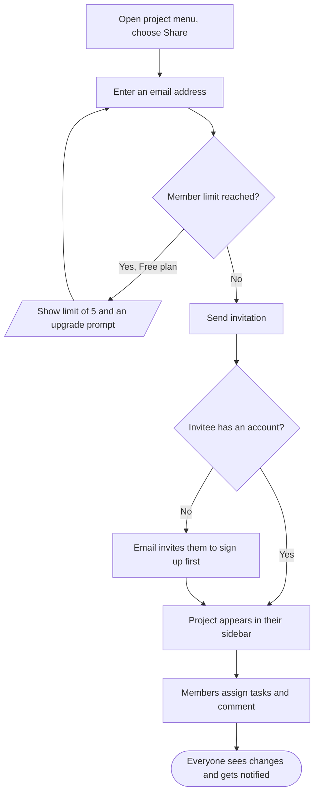

# Share a project

## Goal

Invite other people to a project so they can see and edit its tasks, then assign work and discuss it in comments.

## Flow

## Behavior details

#### Send invitation

**Requires**
- A valid email address
- The inviter is the project owner or an existing member

**Result**
- The invitee is listed as pending until they open the project

**Possible outcomes**
- Invitation accepted: the project appears in their sidebar
- Email bounces: the pending member shows an error and can be re-invited

#### Members assign tasks and comment

**Result**
- Assigning a task notifies the assignee by push or email
- Comments support file attachments up to the plan's upload limit

## Related features

- [Share a project](../features.md#share-a-project)
- [Assign and comment](../features.md#assign-and-comment)
- [Organize tasks in projects and sections](../features.md#organize-tasks-in-projects-and-sections)

## Related flows

- [Upgrade to Pro](upgrade.md): removes the 5 member limit.
- [Get started](onboarding.md): what an invitee without an account goes through.

## Implementation references

- Share dialog: `src/features/sharing/ShareDialog.tsx`
- Invitations: `src/server/invitations.ts`
