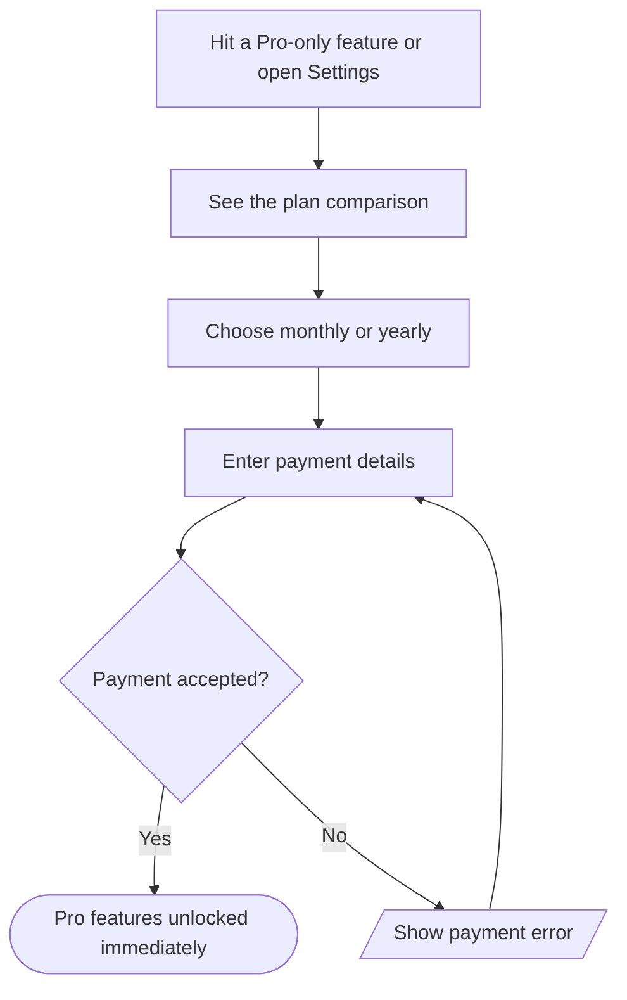

# Upgrade to Pro

## Goal

Move from the Free plan to Pro to unlock reminders, unlimited filters, more collaborators and larger uploads.

## Flow

## Behavior details

#### Hit a Pro-only feature or open Settings

Entry points: the Reminders option on a task, creating a 4th filter, inviting a 6th member, or Settings → Subscription.

#### Payment accepted?

**Possible outcomes**
- Accepted: the account switches to Pro and the blocked action completes
- Declined: the error names the reason when the provider gives one, and the user can retry with another card

## Related features

- [Manage subscription](../features.md#manage-subscription)
- [Reminders](../features.md#reminders)
- [Labels and filters](../features.md#labels-and-filters)

## Related flows

- [Share a project](share-project.md): one of the places the upgrade prompt appears.

## Implementation references

- Billing: `src/features/billing/`, `src/server/billing.ts`
