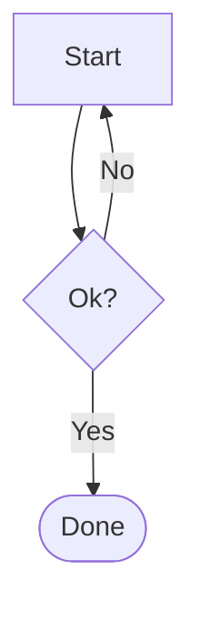

# Working flow

## Goal

A valid flow.

## Flow

```mermaid
flowchart TD
    A[Start] --> B{Ok?}
    B -->|Yes| C([Done])
    B -->|No| A
```

## Related features

- [Good feature](../features.md#good-feature)
- [Nope](../features.md#nope)
